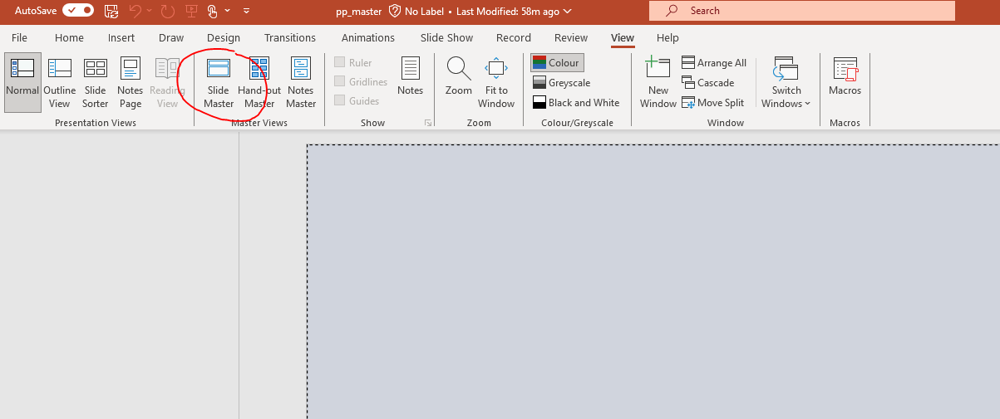
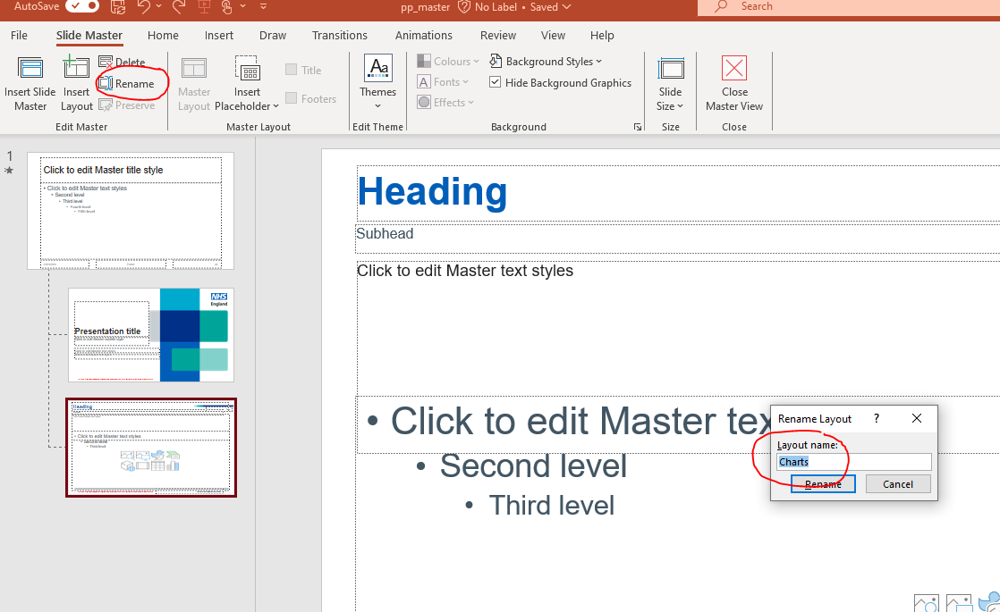
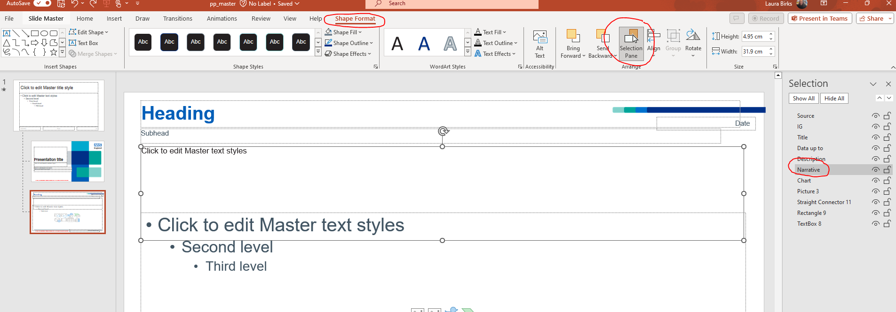

# Simple Powerpoint Example with Officer

Laura Birks\
Email: [laura.birks2\@nhs.net](mailto:laura.birks2@nhs.net){.email}\
GitHub: loz-birks

## Purpose

-   A lot of stakeholders are reluctant to receive outputs in e.g. .html file formats, and want things in powerpoint.
-   This enables them to copy and paste slides across packs for different contexts as well as do things like adding their own commentary.
-   Analysts who are working in R (as the optimal tool for them) are reluctant to spend time copying and pasting outputs to slide decks.

This repo gives a very simple example, using public data, of how to use the officer package to output R content to powerpoint files.

## The Project

### Folder Structure

├── data\
│ └── Monthly-AE-September-2023.csv\
├── helper\
│ ├── plot_file.R\
│ └── screenshots\
│ ├── name_slide.PNG\
│ ├── object_names.PNG\
│ └── slide_master.PNG\
├── LICENSE\
├── officer-simple.Rproj\
├── output\
│ ├── iterations\
│ └── pp_master.pptx\
├── README.md\
└── write_to_pp.R

### Key features

-   **Data folder:** which contains publicly available raw csv data, downloaded from the [NHS England Statistical Work Areas](https://www.england.nhs.uk/statistics/statistical-work-areas/ae-waiting-times-and-activity/ae-attendances-and-emergency-admissions-2023-24/).
-   **Helper folder:** which contains an R script to generate some basic outputs: plot, table, and narrative.
-   **Output folder:** containing the template powerpoint pack, from which to generate slides, and a folder to store iterations.
-   **write_to_pp.R** to source all the scripts and generate the final pack.

## How to use this repo

### 1. Generate slide contents (charts, tables, narrative, etc.)

Use the helper folder to store scripts which import, manipulate, and anything else you might want to do to your data.

> **Tip:** Separate your code into discrete components e.g. a script to import your data and another to manipulate it. This makes it easier to troubleshoot issues and make discrete developments.

### 2. Format template powerpoint pack

Within your template slide pack, all layouts and their elements are controlled within the *Slide Master*. This is accessed via the View pane and allows you to add, remove, and edit individual slide templates.

The first thing you will need to know to write to these slides using the Officer package is the name of the slide layout. Each different layout you create will have a unique name, with which it can be called in R. Viewing / changing this name is as simple as clicking on the *Rename* button within the *Slide Master*.

The only other thing you will need to do is create layouts. Elements can be added within the *Slide Master* and their names managed within the *Selection Pane* in the *Shape Format* menu.

When you are happy with your layouts, save and close the file. You can change this template whenever required.

### 3. Export contents to powerpoint

Within the write_to_pp.R script, source all your helper folder scripts (i.e. run them all from this script). Keeping this all in the same file means that you only have to run 1 script rather than all of them separately in sequence.

Stages to generating pack:

1.  Read in template file

    > `doc <- read_pptx("output/pp_master.pptx")`

    In this case, we are reading in a template pack, but there's no reason you couldn't use any other presentation if you wanted to e.g. append outputs to an existing slide deck.

2.  Add slide

    > `doc <- add_slide(doc, layout = "Charts", master = "Custom Design")`

    For each slide you add, simply specify the template slide name, in this case "Charts".

3.  Add components of slide

    > `doc <- ph_with(doc, plot1, location = ph_location_label(ph_label = "Chart"))`

    This function takes as arguments: the name of the document, the thing you want to insert, and the place to put the thing. You can add any number of elements to a slide.

4.  Save file somewhere

    > `print(doc, target = paste0("output/iterations/", format(Sys.Date(), "%Y%m%d"), " Powerpoint Pack.pptx", sep =""))`

    Finally save your document somewhere, giving it a name. In this example, we're saving it in the output/iterations folder with today's date and then "Powerpoint Pack" as the file name.
